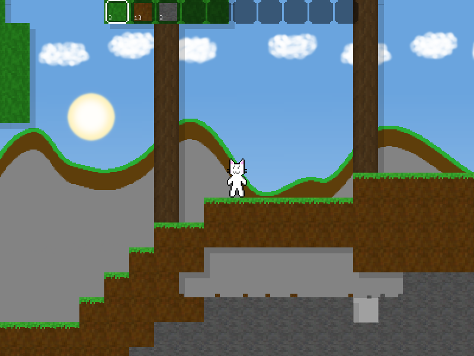
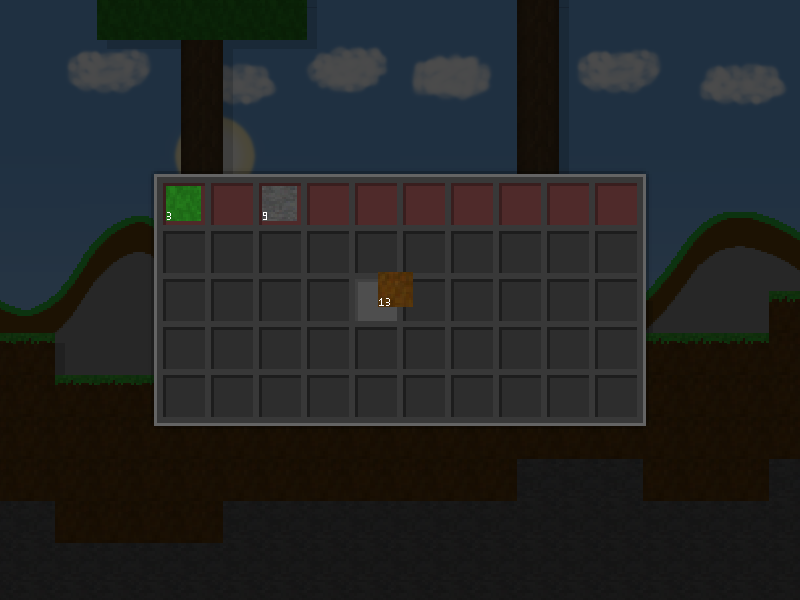

# LoopCube

LoopCube is an open source Survival/Sandbox game written in C++.

It has infinite world generation, a day/night cycle, caves, and more.

Currently it can be compiled with SDL2 and SFML support.

# Screenshots

- *Version 0.3(beta) alpha screenshots*

# Building
## Linux
Ensure you are in the current directory, if not, textures may not load properly

### SDL2

Requires: `sdl2 sdl2_image sdl2_ttf`

###### If you want to simply run the application in the current directory

Run `make debug` (If you don't supply "debug" then it defaults to debug)

If you would like to build for release, run `make release`

###### If you plan on installing

Run `make DATA_LOCATION=/usr/local/share/loopcube release`

### SFML

Requires: `sfml`

###### If you want to simply run the application in the current directory

Run `make -f Makefile.sfml debug`

If you would like to build for release, run `make -f Makefile.sfml release`

###### If you plan on installing

Run `make -f Makefile.sfml DATA_LOCATION=/usr/local/share/loopcube release`

## MacOS

(((soon)))

Albeit the instructions could be similar to Linux, I am not really sure.

## Windows

(((soon)))

# Installing
## Linux

`sudo make DATA_LOCATION=/usr/local/share/loopcube PREFIX=/usr/local/bin install`

Replace `install` with `uninstall` if you want to remove it.

## MacOS

(((soon)))

## Windows

(((soon)))

# License

Licensed under the MIT license, visit `LICENSE` to view more info.
